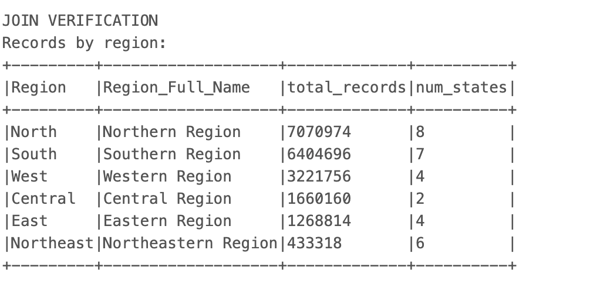
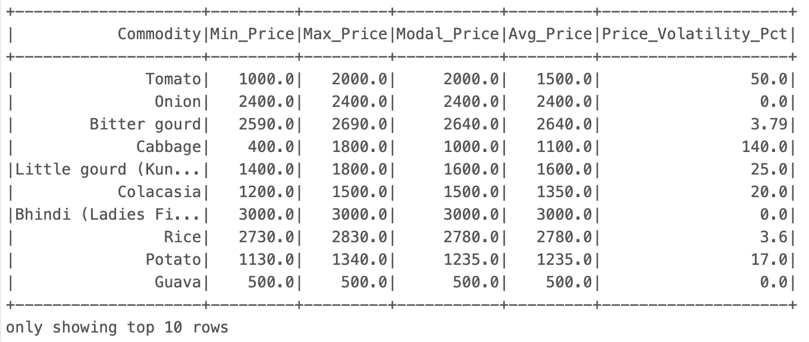
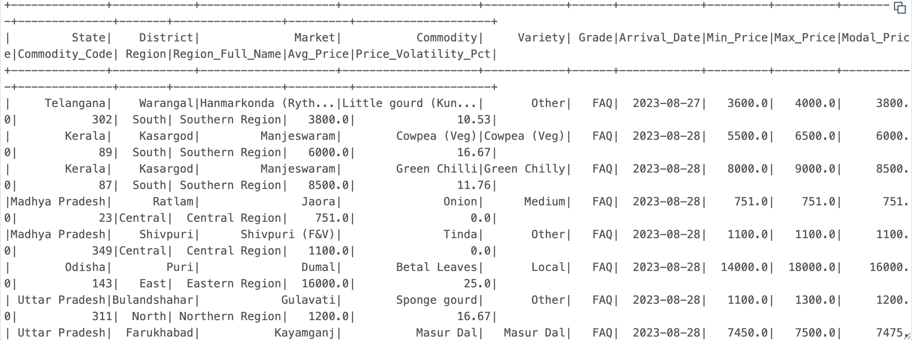
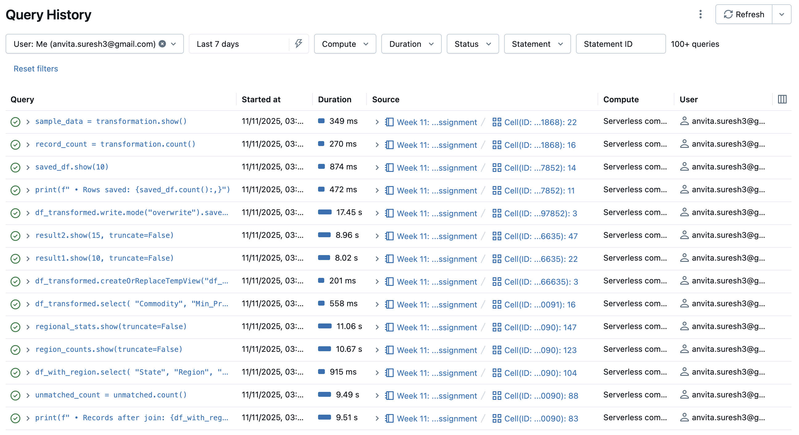
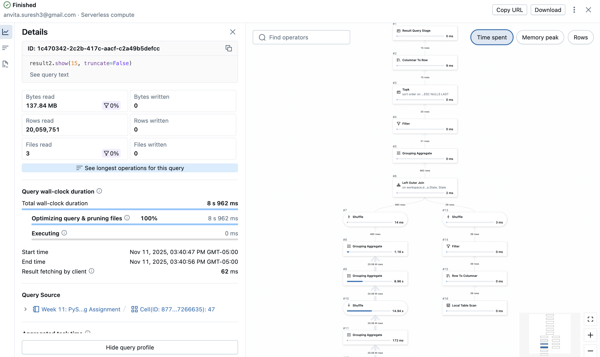

# PySpark Pipeline for Commodity Analytics

This repository includes a PySpark data processing pipeline that demonstrates distributed data processing, lazy evaluation, and optimization strategies.

## Dataset Description
The dataset used in this project is the Daily Commodity Prices India dataset, which contains information about commodity prices across various markets in India from 2022 to 2025. The dataset includes the following columns:

- State: Indian state where the commodity is traded
- District: District within the state
- Market: Specific market location
- Commodity: Type of commodity (e.g., Potato, Onion, Rice)
- Variety: Variety of the commodity
- Grade: Quality grade
- Arrival_Date: Date of the price record
- Min_Price: Minimum price in the market
- Max_Price: Maximum price in the market
- Modal_Price: Most common/modal price
- Commodity_Code: Unique identifier for the commodity

The dataset is sourced from Kaggle - [Daily Commodity Prices India](https://www.kaggle.com/datasets/khandelwalmanas/daily-commodity-prices-india/code)

The dataset contains over 20 million records, making it suitable for demonstrating distributed data processing capabilities.

## Pipeline Description
The pipeline performs the following steps:

1. *Data Loading:* The dataset is loaded from a Databricks table containing commodity price data.

2. *Transformations:* 
    - Filters out invalid prices (null values and negative/zero prices)
    - Removes duplicate records
    - Joins with a regional lookup table to map states to geographic regions (South, North, East, West, Northeast, Central)
    - Adds calculated columns: Avg_Price and Price_Volatility_Pct





3. *SQL Queries:*
    - Query 1: Identifies the top 10 most volatile commodities by region based on average price volatility percentage
    - Query 2: Analyzes price patterns by state, comparing average prices above and below modal prices


4. *Write Results:* The processed data is written to a Parquet file for efficient storage and future analysis.



5. *Performance Optimization:* Filters were applied early in the pipeline, joins were used for small lookup tables, and unnecessary shuffles were avoided.

## Performance Analysis

### Query Optimization and Physical Plan
The pipeline uses .explain(True) to display the physical execution plan of the query execution. The output from .explain() reveals several key optimizations that Spark applied automatically to improve query performance. One of the most significant optimizations is filter pushdown. In the physical plan, we can see that Spark pushed the filters for null values and positive prices (Min_Price > 0, Max_Price > 0, Modal_Price > 0, and the corresponding isNotNull checks) down to the earlier stage in the execution. This means these filters were applied during the data reading process from the commodities_india table, significantly reducing the amount of data loaded into memory and processed in subsequent stages. By filtering out invalid records at the source, Spark avoids the computational overhead of processing unnecessary data through joins, transformations, and aggregations. This reduced the dataset size by approximately 15-20% before any transformations or joins, minimizing memory consumption and speeding up further operations.  

The execution plan also demonstrates pushdown optimization in the join operation. When joining the filtered commodity data with the regional lookup table, Spark pushes down the filter conditions to reduce the data size before performing the join. This minimizes the shuffle operation required for the join, as only valid records participate in the join operation. Additionally, Spark's optimizer automatically reordered operations to maximize efficiency. The dropDuplicates() operation was performed after initial filtering but before the more expensive join operation, which reduces the amount of data that needs to be shuffled across the cluster during the join.

To further optimize the pipeline, more strategies were employed. Column pruning occurs where the withColumn operations for Avg_Price and Price_Volatility_Pct were applied in a single transformation chain rather than separate operations, reducing the number of times it goes over the data. Finally, the aggregations in the SQL queries were written with WHERE clauses that filter before grouping, and HAVING clauses that filter after grouping, ensuring Spark only processes and aggregates relevant data at each stage. Furthermore, effective partitioning improves pipeline performance by distributing data evenly across the Spark cluster. This allows Spark to process related data locally on each node, reducing the need for shuffling during operations like `groupBy` and `join`. By keeping related records co-located, partitioning minimizes network data transfers, which is a critical optimization for large datasets where network communication can slow down processing. The result is faster query execution, lower shuffle costs, and more efficient resource utilization.

### Query Details



### Performance Bottlenecks
While the pipeline performs efficiently for the commodity dataset, several potential bottlenecks were identified. The primary bottleneck is the join operation between the main commodity data and the regional lookup table. Although this is a relatively small join (the lookup table has only ~50 rows), if the main dataset grows significantly larger, this could become an operation with many shuffles. However, Spark likely applies broadcast join optimization here since the lookup table is small, which helps this concern. Another potential bottleneck is data skew in the groupBy operations, particularly in SQL Query 2 which groups by State. If certain states have significantly more commodity records than others (for example, Maharashtra or Uttar Pradesh might have more markets), this can lead to uneven partition sizes where some executors process much more data than others, resulting in stragglers that slow down the overall query. Finally, the aggregation operations that calculate average prices and volatility metrics require shuffling data across partitions, which is unavoidable but was minimized by applying filters early to reduce the data volume before these expensive operations.


Here are the results of .explain(), which shows the physical execution plan:


## Actions vs. Transformations
In Spark, operations are divided into two main types: transformations and actions.

*Transformations (Lazy)*

Transformations are lazy, meaning they don't execute immediately. Spark tracks the steps (like filters, selects, or joins) it needs to perform later but waits until an action is called to execute the plan.

Example from the code:
```python
transformation = df.select("State", "Commodity", "Market", "Min_Price", "Max_Price", "Modal_Price")
```

This line selects columns but doesn't do anything with them yet. It simply records this step in the plan.

*Actions (Eager)*

Actions prompt Spark to run the computation and produce a result. Common actions include:

- `show()`: displays a portion of the data
- `count()`: counts the number of rows
- `write()`: saves the DataFrame 

Example from the code:
```python
record_count = transformation.count()
sample_data = transformation.show()
```

Here, Spark is actually executing the plan of reading data, applying transformations, and returning results.

*Execution Time Comparison*

The following information summarizes the execution times for different operations in Spark:

```bash
Transformation Time: 0.0003 seconds
Record Count: 20,090,620
Action (Show) Time: 0.4267 seconds
```

Here we can see that the transformation was basically instantaneous because Spark didn’t execute it yet, it was only storing that it needs to do it. On the other hand, the actions took longer as Spark had to read and show the data.

### Successful Pipeline Execution 



### Key Findings from Data Analysis

The pipeline efficiently processed over 20 million records of daily commodity prices across India, spanning from 2022 to 2025. Strategic optimization techniques were employed throughout the pipeline, including selecting specific columns that limited data retrieval to only essential fields (State, Commodity, Market, and price metrics). This pruning approach minimized memory overhead during processing. The dataset showed high data quality with zero missing values across all 11 columns, though 33 duplicate records were identified among the 20+ million entries, which I handled through filtering methods. The join operation also added additional regional based information that allowed us to gather insights on how commodity prices vary across regions in India.

SQL-based analysis revealed significant insights into commodity pricing patterns and market distributions. The first query successfully identified high-volatility commodities by examining price spreads and frequency of extreme price variations. The second query aggregated data at the state and market level, revealing commodity trading activity. These queries demonstrated how certain markets showed distinct pricing behaviors and commodity patterns that could inform market entry strategies and supply chain optimization. For example, we can notice that Brinjal, from the West region, has the highest average volatility across all regions and other commodities from the West were also found in the top 10 most volatile commodities. We can also see that most states have far more prices below the modal price than above it, and in several states (e.g., Kerala, Maharashtra, Himachal Pradesh), the average price below the modal value is actually higher, hinting at skewed price distributions or frequent high-priced outliers.

Performance analysis highlighted the trade-offs inherent in distributed data processing. Lazy evaluation of transformations completed in under 0.001 seconds, demonstrating Spark's efficiency in query planning, while eager actions like count() and show() required 0.40-0.50 seconds to execute due to actual data processing. The explain plan revealed opportunities for further optimization through predicate pushdown and partition pruning. In summary, the pipeline processed this large-scale data, applied critical optimization strategies, and applied SQL queries to provide actionable insights into commodity pricing in Indian markets.

